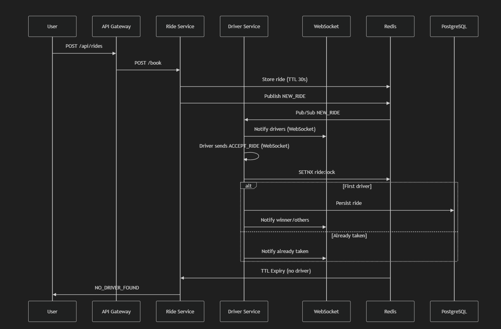
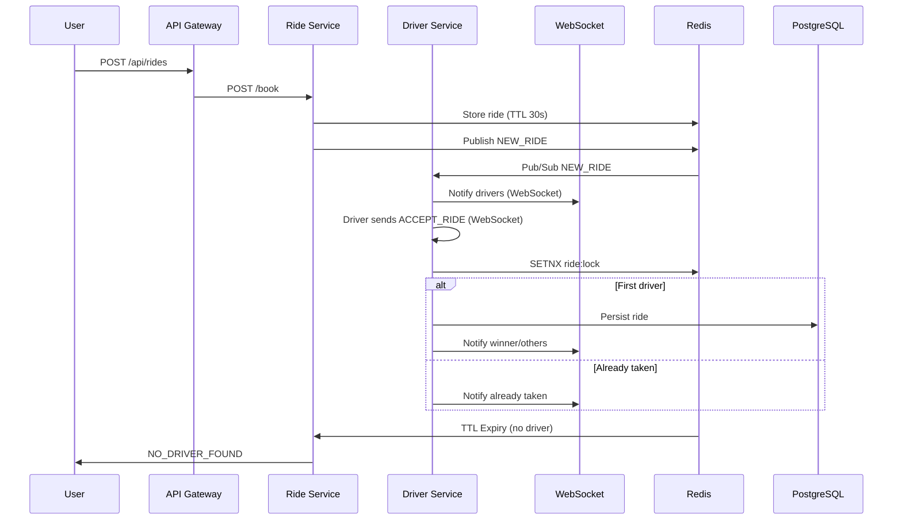

# Mini-Uber Real-Time Driver Matching

## Why This Project?

This project focuses on solving real distributed system challenges:

- Preventing multiple drivers from accepting the same ride
- Handling high concurrency safely
- Designing low-latency real-time communication
- Using atomic operations for consistency
- Gracefully handling driver timeouts

It reflects backend engineering patterns used in real-world ride-hailing systems.


## Tech Stack

- **Node.js + Express** — Microservices
- **Redis** — Pub/Sub, TTL, Distributed Locking
- **WebSockets** — Real-time driver communication
- **PostgreSQL** — Durable data storage
- **Docker** — Containerized deployment


## System Flow

- **User** requests a ride via API Gateway.
- **Ride Service** stores ride in Redis (TTL 30s, configurable) and publishes NEW_RIDE event.
- **Driver Service** receives event, notifies drivers via WebSocket.
- **Drivers** compete to accept. First to accept wins (atomic lock in Redis).
- **Winner** is persisted to PostgreSQL. All drivers notified.
- If no driver accepts in 30s, user is notified: NO_DRIVER_FOUND.

## Architecture Diagram





## Quick Start

1. **Build & Run All Services:**
   ```sh
   docker compose up --build
   ```

2. **Driver goes online (WebSocket):**
   ```sh
   npx wscat -c ws://localhost:7001
   # Send:
   {"type":"ONLINE","driverId":"d1","zone":"HSR_LAYOUT"}
   ```

3. **User requests a ride:**
   ```sh
   curl -X POST http://localhost:5002/book \
     -H "Content-Type: application/json" \
     -d '{"userId":"u1","pickup":"HSR","destination":"BTM","fare":200,"zone":"HSR_LAYOUT"}'
   ```

4. **Driver accepts ride (WebSocket):**
   ```
   {"type":"ACCEPT_RIDE","rideId":"<rideId>","driverId":"d1"}
   ```
   (Replace <rideId> with the actual rideId from the response)


- First driver to accept wins. Others get RIDE_ALREADY_TAKEN.
- If no driver accepts in 30s, user gets NO_DRIVER_FOUND.


## Future Improvements

- Kafka for high-throughput event streaming  
- Geo-based driver discovery  
- Kubernetes deployment  
- API Gateway rate limiting  
- Observability (Prometheus + Grafana)  
- Distributed tracing  
